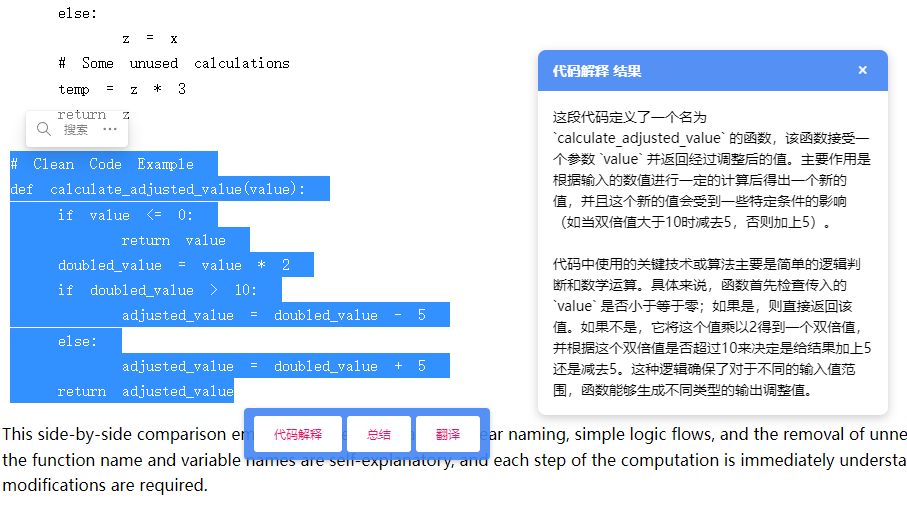
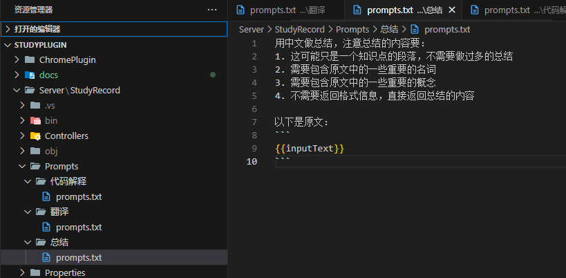

# 一个利用浏览器插件辅助学习的LLM项目

项目的主要作用是，在打开一个网页的时候，可以在选择一段文本后，会有一个悬浮窗，里面多个按钮，可以选择对这段文本进行不同的操作，比如翻译、总结等。

项目有个组成部分

1. 浏览器插件
2. 后端

## 浏览器插件

浏览器插件是一个Chrome插件，主要负责在浏览器中捕获用户的操作，比如选择文本、点击按钮等。
它会将用户的操作发送到后端，并接收后端的响应，然后将响应结果展示在浏览器中。
浏览器插件的主要功能有：

- 捕获用户选择的文本
- 显示悬浮的按钮选择窗
- 发送用户的操作到后端
- 显示后端的响应结果
- 处理用户的操作

## 后端

后端是一个asp.net core 服务，主要负责处理浏览器插件发送的请求，并返回相应的结果。后端的主要功能有：

- 接收浏览器插件发送的请求
- 处理请求，调用对应LLM模型提示词模板进行处理
- 返回处理结果

- 提示词模板通过一个Prompts 目录进行管理
  - 子目录名作为提示词模板的名称，可以在浏览器插件中被选中
  - 服务会监听提示词模板的文本变更，修改后会自动生效

## 介绍视频

https://www.bilibili.com/video/BV1Lg5Fz2ERc/

